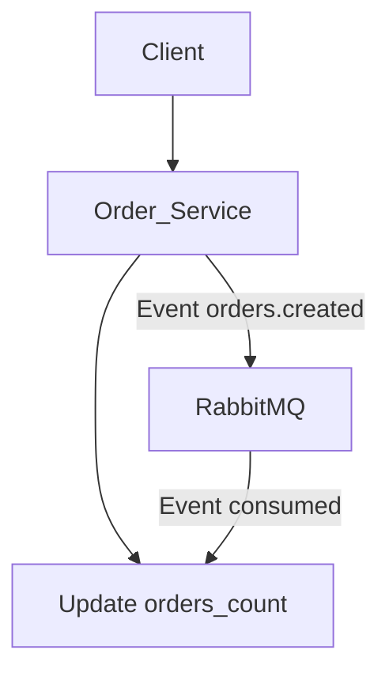

# MonokStackUp

This repository contains two microservices: **Customer Service** and **Order Service**, which interact through events using **RabbitMQ**.

## 📌 Prerequisites

Before getting started, ensure you have installed:
- **Docker** and **Docker Compose**
- **Ruby 3.x** and **Rails 8.x** (if you want to run the services without Docker)
- **PostgreSQL**
- **RabbitMQ**

## 🚀 Setting Up and Running the Services

### 1️⃣ Clone the Repository
```sh
git clone https://github.com/johncuervo/MonokStack
cd <REPO_NAME>
```

### 2️⃣ Configure Environment Variables
The **.env.example** file contains the environment variables that are required for the project with their default values for local development. Use this file as a reference to create a .env file.

```env
# Postgres configuration
POSTGRES_HOST=
POSTGRES_USERNAME=
POSTGRES_PASSWORD=

# RabbitMQ configuration
RABBIT_HOST=
RABBIT_PORT=
RABBIT_VHOST=
RABBIT_USER=
RABBIT_PASSWORD=
```

### 3️⃣ Start Services with Docker Compose
Run the following command:
```sh
docker-compose --profile monok-back up --build
```
This will start:
- **Customer Service** at `http://localhost:3001`
- **Order Service** at `http://localhost:3002`
- **RabbitMQ** at `http://localhost:15672` (user: `guest`, password: `guest`)
- **PostgreSQL** as the database

### Known Errors and Solutions

#### Error: Issues When Starting a Docker Profile for the First Time

Sometimes, when starting a Docker profile for the first time, the build may fail for unknown reasons. This issue often occurs because the user has related containers from older versions.

**Solution**

⚠️  **Caution:** this solution removes all images, containers and volumes that exist in the environment.

To fix this kind of error, it is necessary to stop and remove all old containers. It is even recommended to prune the system and volumes.

1. Stop all running containers:
    ```sh
    docker stop $(docker ps -aq)
    ```

2. Remove all containers:
    ```sh
    docker rm $(docker ps -aq)
    ```

3. Prune the system and volumes:
    ```sh
    docker system prune -a
    docker volume prune
    ```

After performing these steps, try starting the Docker profile again.

---

### 4️⃣ Enable event listener in Customer Service

Run the following command to start the event consumer in Customer Service:

```sh
docker exec -it customer-monok rails runner 'OrderCreatedConsumer.start'
```

### 5️⃣  Test order creation flow

Now you can test the order creation flow using the Postman collection located in the project root.

## ✅ Running Tests
To run **unit and integration tests** with **RSpec**, use:
```sh
docker exec -it customer-monok rspec 
```
```sh
docker exec -it order-monok rspec 
```

## 🔗 Microservices Relationship

### 📌 General Architecture
The **Customer** and **Order** services are decoupled and communicate via RabbitMQ events.

1. **System creates an order** → Order Service receives the request.
2. **Order Service validates the customer** → Sends a GET request to Customer Service.
3. **If the customer exists**, Order Service creates the order in the database.
4. **Order Service publishes an `orders.created` event** to RabbitMQ.
5. **Customer Service consumes the event** and updates the customer’s `orders_count`.

### 📊 Interaction Diagram



---

## 🏗️ Architecture and Event Flow
- **Decoupling**: Services do not depend directly on each other; they use events.
- **Scalability**: More consumers can be added without affecting existing services.
- **Resilience**: If a service fails, the event remains in RabbitMQ until reprocessed.

---

## 🔧 Available Endpoints

### 📌 Customer Service
| Method | Endpoint | Description |
|--------|---------|-------------|
| GET | `api/v1/customers/:id` | Retrieves customer information |

### 📌 Order Service
| Method | Endpoint | Description |
|--------|---------|-------------|
| GET | `api/v1/orders?customer_id=1` | Retrieves customer orders |
| POST | `api/v1/orders` | Creates a new order |

---

